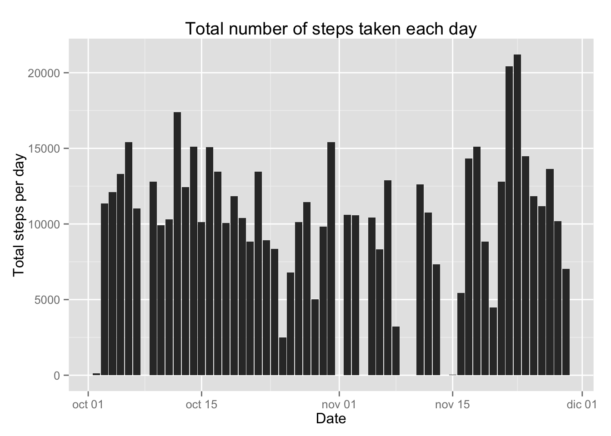
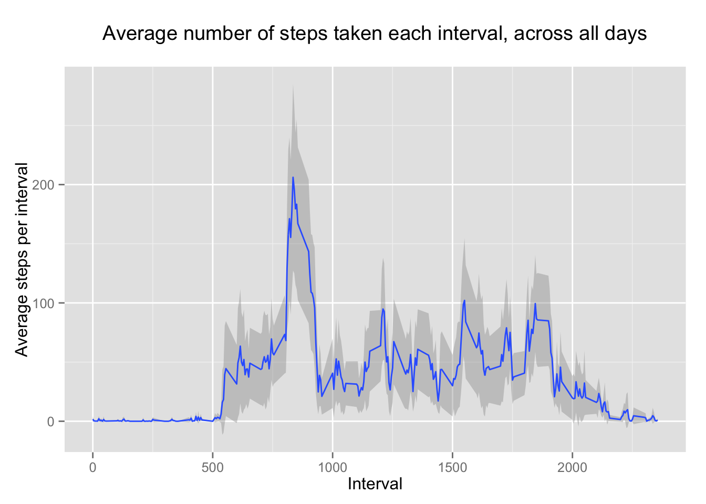
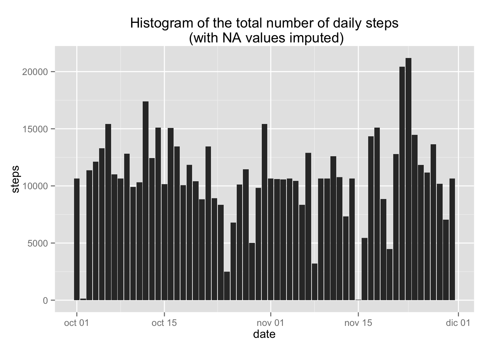
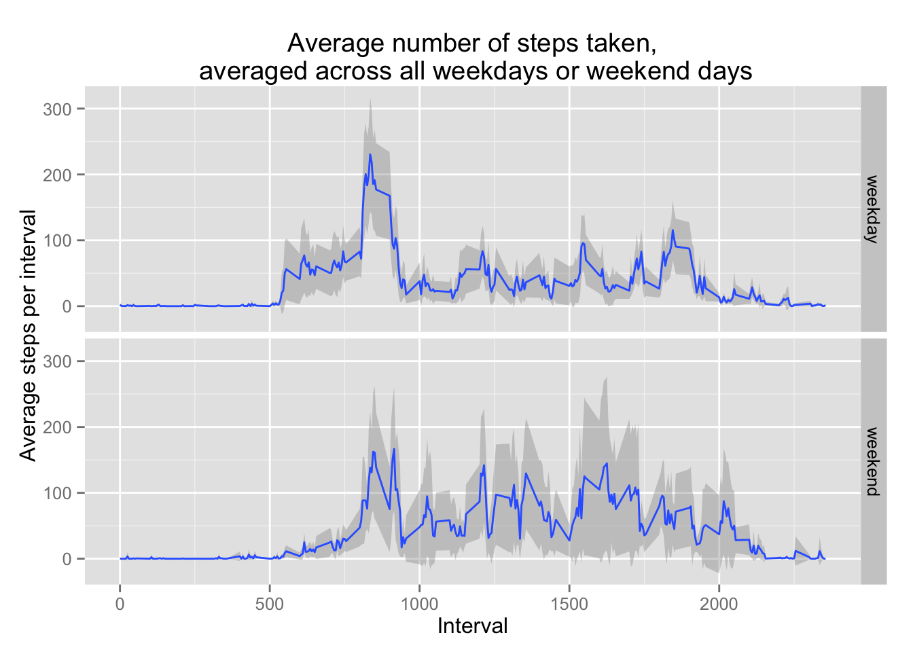

# Reproducible Research: Peer Assessment 1
Juanan Pereira  
15 de agosto de 2014  


## Loading and preprocessing the data

```r
library(ggplot2)
# setwd("~/tmp")

dataFile <- 'activity.zip'

# Assuming that you haven't already downloaded and extracted this file
fileUrl  <-"https://d396qusza40orc.cloudfront.net/repdata%2Fdata%2Factivity.zip"
# Otherwise, please, mark as comments the following 3 lines:
download.file(fileUrl, destfile = dataFile, method = "curl")
## Unzip zip archive
unzip(dataFile)

data <- read.csv2(file = 'activity.csv',header=TRUE,sep=",",colClasses=c(NA, "Date",NA))
```

## What is mean total number of steps taken per day?

```r
totalStepsDaily <- aggregate(data$steps, by=list(data$date), sum)
names(totalStepsDaily) <- c("date","steps")

ggplot(totalStepsDaily, aes(x=date,y=steps)) + 
    geom_histogram(stat="identity") + 
    labs(title="Total number of steps taken each day", y="Total steps per day", x="Date")
```

 


```r
### Mean and median number of steps taken per day
mean(totalStepsDaily$steps, na.rm=TRUE)
```

```
## [1] 10766
```

```r
median(totalStepsDaily$steps, na.rm=TRUE)
```

```
## [1] 10765
```

## What is the average daily activity pattern?


```r
# Function to calculate the mean and 
# 95% confidence interval around it
# See:
# http://sites.psu.edu/stat250fall13/wp-content/uploads/sites/4528/2013/10/lab_6.pdf
# http://biostat.mc.vanderbilt.edu/wiki/pub/Main/LeenaRNotes/CI.R

ci <- function(sample){
  m <- mean(sample)
  data.frame(y=m,
             ymin = m-(1.96*sd(sample)/sqrt(length(sample))),
             ymax = m+(1.96*sd(sample)/sqrt(length(sample))))
}

# Plot the average number of steps per interval.

steps_mean <- qplot(x=interval, y=steps,
        data=subset(data, complete.cases(data)),
        geom='smooth', stat='summary', fun.data=ci) +
        labs(title='Average number of steps taken each interval, across all days\n',
       y='Average steps per interval', x='Interval')

steps_mean
```

 

## Imputing missing values


```r
# Calculate and report the total number of missing values in the dataset 
# (i.e. the total number of rows with NAs)
total_NAs <- sum(!complete.cases(data))
# 2304
step_NAs <- sum(is.na(data$steps))
#2304
```

Data contains 2304 NA's , all of them due to missing number of steps.

Q: Devise a strategy for filling in all of the missing values in the dataset. 
   The strategy does not need to be sophisticated. For example, you could use
   the mean/median for that day, or the mean for that 5-minute interval, etc.

A: The mean of steps for a day seems to have more variation than the average
   of steps taken during each interval across differente days. So, we will   
   fill the missing cases with the latter.


```r
interval_means <- aggregate(formula=steps~interval, data=data,FUN=mean, na.rm=TRUE)
interval_means$imputed_steps <- floor(interval_means$steps)
imputed <-  merge(data, interval_means[,c('interval', 'imputed_steps')], by='interval')

# Create a new dataset that is equal to the original dataset but with the 
# missing data filled in.

imputed$steps <- ifelse(is.na(imputed$steps), imputed$imputed_steps, imputed$steps)
# we don't need this column anymore
imputed$imputed_steps <- NULL

# Make a histogram of the total number of steps taken each day and Calculate 
# and report the mean and median total number of steps taken per day.
# Do these values differ from the estimates from the first part of the 
# assignment? What is the impact of imputing missing data on the estimates 
# of the total daily number of steps?

daily_imputed <-  aggregate(formula = steps~date, data = imputed,
            FUN = sum, na.rm=TRUE)

mean_imputed_steps <- mean(daily_imputed$steps)
# 10749  vs. 10766.19 (less than 1% of variation)

median_imputed_steps <- median(daily_imputed$steps)
# 10641 vs. 10765 () (less than 1% of variation)
```

Q: What is the impact of imputing missing data on the estimates of the 
   total daily number of steps?

A: It seems that the original estimates have near no bias due to missing 
   values


```r
# Histogram of the total number of daily steps (with NA values imputed)
ggplot( imputed , aes(x=date,y=steps)) + 
  geom_histogram(stat="identity") + 
  labs(title='Histogram of the total number of daily steps\n (with NA values imputed)')
```

 

## Are there differences in activity patterns between weekdays and weekends?
Create a new factor variable in the dataset with two levels – “weekday” 
and “weekend” indicating whether a given date is a weekday or weekend day.


```r
# Asumming that we want English labels & dates
Sys.setlocale(category = "LC_TIME", locale = "C")
```

```
## [1] "C"
```

```r
# Label each date as weekday/weekend 
imputed$weeklabel <- factor(ifelse(weekdays(imputed$date) %in% c('Saturday','Sunday'), 'weekend', 'weekday'))

# Make a panel plot containing a time series plot (i.e. type = "l") of the 
# 5-minute interval (x-axis) and the average number of steps taken, averaged 
# across all weekday days or weekend days (y-axis). 

steps_mean %+% imputed + facet_grid(weeklabel~.) +
  labs(title='Average number of steps taken,\n averaged across all weekdays or weekend days')
```

 

Q: Are there differences in activity patterns between weekdays and weekends?

A: It seems that there is less activity on the weekends, specially between
  the morning intervals (and on weekends, logically, the activity intervals
  start later)

